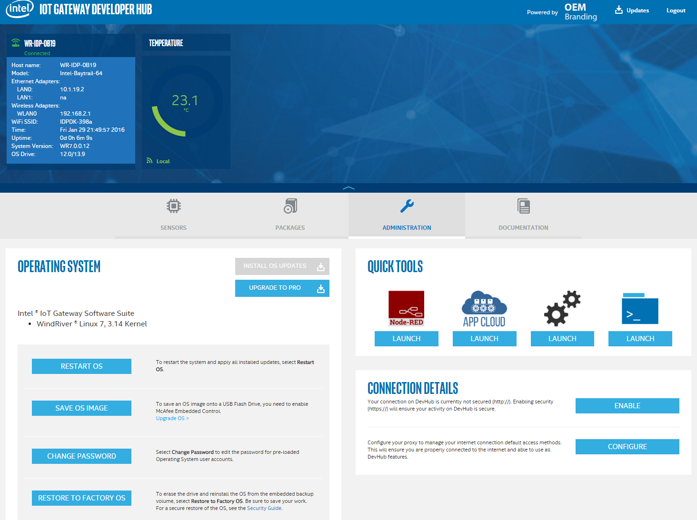

# Changing the Default IP Address #
<cr>

## Overview ##
When an IoT Gateway that uses Intel® IoT Gateway Technology is first installed, it is running as an WiFi access point.  This supports an easy connection from a client for web based access to Intel® IoT Gateway Developer Hub, out of the box tutorials, and later configuration.  To facility easy access, the default IP address of the IoT Gateway is set to 192.168.1.1.  Sometimes, this address conflicts with the network you may want to connect the IoT Gateway to via a wired connection.  If this is the case, you can follow these steps to change the IP adress the IoT Gateway is using.

## Required Hardware ##
-   IoT Gateway that uses Intel® IoT Gateway Technology
-   A system running a web browser.  In the case of this tutorial, we used a laptop running Windows 10 and Chrome.

## Assumptions ##
-   Intel® IoT Gateway Technology version 3.1 or above
-   Your client is connected to the IoT Gateway wirelessly an access point

## Changing the IP Address ##
The administration console is web based and can be easily accessed via the Developer Hub.  To access the Developer Hub, open your web browser and go the <http://192.168.1.1>. Log in with the username and & password.  Once connected, you should see something like this:

Click on the Administration Icon.  You should see a screen like this:

Now click on the LAUNCH button under the Gear icon.  This will open another browser window or tab.  Log in with your root password.  It will look like this:

This is the admin console for the gateway.  From here you can manage and configure many gateway settings but we'll be focusing on the network section.

1. Click on Network from the menu bar and select Interfaces
2. To the right of the 1st Network section (currently configured as LAN and br-lan), click on Edit
3. Change the IP Address from 192.168.1.1 to 10.0.0.1.
4. Click on Save & Apply
5. It will take a few moments for the new configuration to apply

	Note: You are changing the IP address of interface you are using to access the IoT Gateway.  You will need to change your URL to the new address after Clicking on Save & Apply and you may need to disconnect and reconnect your WiFi to the gateway to obtain a new IP address.

You can now connect the IoT Gateway to a wired connection that is using the 192.16.1.x network and not conflict.

## References ##
-   none

*indicates that third-party names might be the property of others.