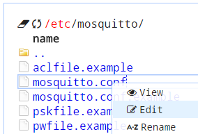
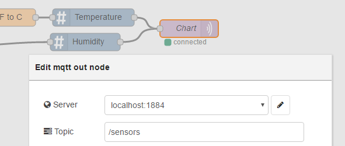

# Getting Started with Helix Device Cloud (HDC) #
<cr>

## Overview ##
Wind River® Helix™ Device Cloud is a device management platform for the Internet of Things (IoT) that helps organizations greatly reduce the complexities of building and operating large-scale device deployments.  Specifically, it is the management conosle that Wind River uses to manage their Wind River Linux operating system that the Intel IoT Gateway is based on.

## Required Hardware ##
-   IoT Gateway that uses Intel® IoT Gateway Technology

## Assumptions ##
-   [Intel® IoT Gateway Technology version 3.1](https://shopiotmarketplace.com/iot/index.html#/details?pix=58) or above
-   An internet connection to the gateway that has the ability to talk to the HDC cloud

## Getting Access to HDC ##
Prior to configuring your gateway to connect to Helix Device Cloud, it is necessary to get a trial account.  You can do that by clicking the contact  us link on this site:
[http://www.windriver.com/products/helix/device-cloud/](http://www.windriver.com/products/helix/device-cloud/)

## Installing the HDC Agent ##
Warning: You should have access to HDC prior to installing the HDC agent on the gateway because part of the installation is configuring the startup.bin file to point to your instance of HDC.

When you have access, download the HDC 2.1 agent from here:
[intel-iot-gateway/Getting Started With Helix Device Cloud (HDC)/hdc/](https://github.com/intel-iot-devkit/intel-iot-gateway/blob/master/Getting%20Started%20With%20Helix%20Device%20Cloud%20(HDC)/hdc/HDC21forIDP31.tgz)

Connect to the Developer Hub on the IoT gateway, click on the Administration tab and Launch Cloud Commander. If you need a more in depth tutorial on how to use Cloud Commander, please refer to the that [tutorial](https://github.com/intel-iot-devkit/Intel-IoT-Gateway/tree/master/Getting Started With Cloud Commander).

Copy the HDC 2.1 agent files to the gateway by positioning your windows so that you can drag the file on the file editor that you downloaded earlier and copy them to the IoT gateway.

Then extract it:

Then launch the built in command interface in cloud commander:

Run the following commands:

cd /root

rpm -ihv *.rpm
 

The agent is now installed, however you need to configure the startup.bin file to point you your instance of HDC.  It is critical that you do this now, before you reboot so that you don’t connect to the wrong instance.

Open your HDC instance and go to your profile settings:

Download the startup.bin file from your profile page on Helix Device Cloud and save it to your local machine.
Go back to the Developer Hub interface and copy over the startup.bin file into the /opt/intel/ubroker/bin/ directory, overwriting what is already there if that file is already present.

Now reboot your gateway and log back into your HDC console.  You should now see the gateway listed in HDC.

## (Optional) Resolving the MQTT service conflict ##
The HDC agent service uses port 1883, which by default is used by the Intel IoT Gateway for it's Mosquitto MQTT broker.  The MQTT broker is also used in the charting flow within the Developer Hub.  If you would like to continue to use the Mosquitto MQTT broker or charting in the Developer Hub after you install the HDC agent, follow these instructions:

Edit the /etc/mosquitto/mosquitto.conf file and change the listener to another port (1884 for example)

Click ctrl + s to save the changes and esc to go back to the file explorer view.

Once you have changed the listener to another port, then you need to change the node-red charting flow to use the same port.  Lot into node-red from the administration tab in the Developer Hub.  Change any flows that are using MQTT such as the default charting flows to use the new port.

