# Getting Started with Node-Red and AWS IoT #
<cr>

## Overview ##
Node-RED is a tool for wiring together hardware devices, APIs and online
services in new and interesting ways. Node-RED provides a browser-based
flow editor that makes it easy to wire together flows using the wide
range nodes in the palette. Flows can be then deployed to the run-time in
a single-click. The light-weight run-time is built on Node.js, taking
full advantage of its event-driven, non-blocking model. This makes it
ideal to run at the edge of the network. Amazon* Web Services (AWS IoT) is a managed cloud platform that lets connected devices easily and securely interact with cloud applications and other devices. AWS IoT can support billions of devices and trillions of messages, and can process and route those messages to AWS endpoints and to other devices reliably and securely. With AWS IoT, your applications can keep track of and communicate with all your devices, all the time, even when they aren’t connected.  AWS IoT makes it easy to use AWS services like AWS Lambda, Amazon Kinesis, Amazon S3, Amazon Machine Learning, and Amazon DynamoDB to build IoT applications that gather, process, analyze and act on data generated by connected devices, without having to manage any infrastructure.

## Required Hardware ##
-   IoT Gateway that uses Intel® IoT Gateway Technology

## Assumptions ##
-   [Intel® IoT Gateway Technology version 3.1](https://shopiotmarketplace.com/iot/index.html#/details?pix=58) or above
-   Node.js is installed on the IoT Gateway (installed by default)
-   Node-RED node node-red-node-serialport is installed on the IoT Gateway (installed by default)
-   Node-RED is installed on the IoT Gateway and is running (installed by default)

## Setting up AWS IoT ##
Sign up for a new AWS IoT account by logging in with your existing Amazon account or creating a new one by visiting [https://aws.amazon.com/iot/]( https://aws.amazon.com/iot/)

Click to start the interactive tutorial after you log in.

Read through the first part of the tutorial that explains the different parts of the solution (Steps 1–6).  When you are done with that you will be prompted to create a thing:

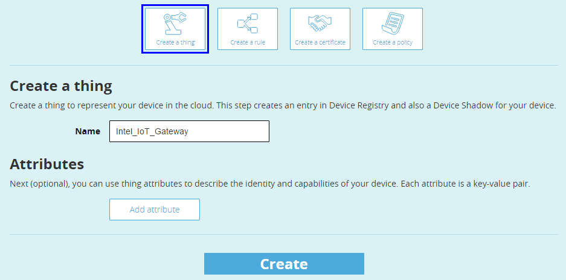

Click on View Thing

Click on Connect a device:

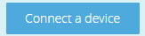

Choose the NodeJS SDK and then click Generate certificate and policy

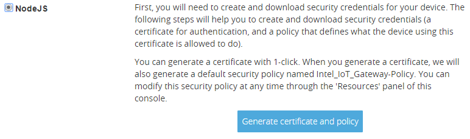

Click to download the public key, private key and the certificate to your local computer.  Place them in a directory where you can find them in a future step.  These certificates are what authenticate the IoT gateway and allow it to send data to the AWS IoT cloud.  They will be used later.

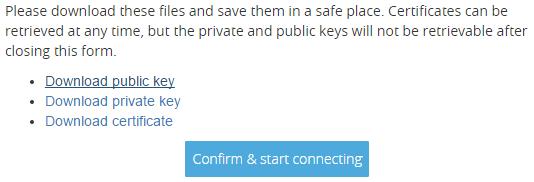

Leave this tab in your browser open and in another browser tab navigate back to the Intel® IoT Gateway Developer Hub.  You will need this information for AWS IoT to configure your gateway in the later steps.

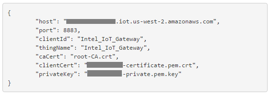

## Setting up the Node-RED Flow ##

Connect to the Developer Hub, click on the Administration tab and Launch Cloud Commander.  If you need a more in depth tutorial on how to use Cloud Commander, please refer to the that [tutorial](https://github.com/intel-iot-devkit/Intel-IoT-Gateway/tree/master/Getting%20Started%20With%20Cloud%20Commander).

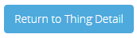

Once Cloud Commander is open, scroll down to the bottom of the page and click the Console icon.

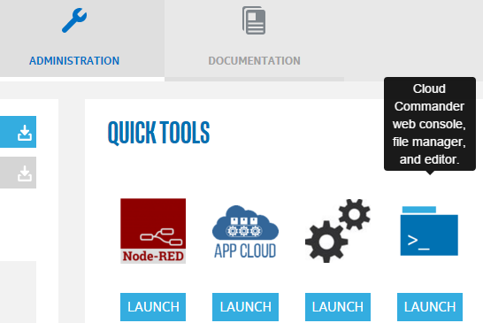

This will bring up a console where you can copy and paste the following commands to install the AWS IoT Node-Red Node:

 Change to the home directory:
 >cd ~
 
 Make a new directory to hold the AWS certificates:
 >mkdir .awscerts
 
 Go into that directory and download the public key (ensure your gateway is connected to the internet):
 >cd .awscerts
 >
 >wget https://www.symantec.com/content/en/us/enterprise/verisign/roots/VeriSign-Class%203-Public-Primary-Certification-Authority-G5.pem -O root-CA.crt
 
 Switch to the Node-Red working directory:
 
 >cd /usr/lib64/node_modules/node-red/node_modules
 
 Download the packages that are required to make the node work:
 >npm install node-red-contrib-aws-iot-hub

Once this is done, your screen should look like the following:

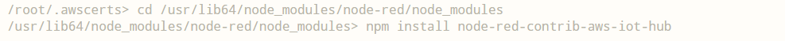
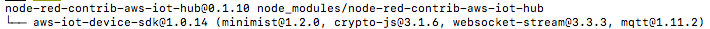

Now restart Node-Red by issuing the following commands:

>systemctl stop node-red-experience

>systemctl start node-red-experience

Alternatively you can start and stop the service from the packages tab.  It will take a few seconds to start.

Hit escape to exit the command view and go back to the file explorer view.  Open the folder that you created earlier /root/.awscerts.  Position your windows so that you can drag those three files on the file editor that you downloaded earlier from AWS IoT and copy them to the IoT gateway.

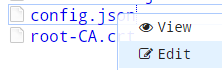

Once the files are copied, you need to rename them to match the format needed by the AWS IoT Node Red node. The node expects the files to be named as follows (in fact, it should align with the latest AWS IoT generated certificate. No changes should be required if you freshly generate it from latest AWS IoT service):

    /root/.awscerts/
                    |--YourUniqueClientIdentifier.private.key
                    |--YourUniqueClientIdentifier.cert.pem
                    |--root-CA.crt (downloaded earlier)
                    
Where YourUniqueClientIdentifier is the AWS thing name what you put when creating your thing.  You can refer to the other tab that you have open.  For example: If Intel_IoT_Gateway was the name of your AWS IoT Thing you created, then your folder would look like this:

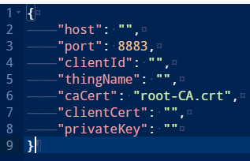

You can ignore the *.public.key file.

# Connecting a Sensor ##

If not already connected, the RH-USB sensor to the IoT gateway.  You should see the gauge go live on the IoT Developer Hub dashboard.

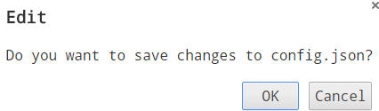

Click back on the Administration tab in the Intel IoT Developer Hub.  Click on the Node Red icon under quick tools to open the visual programming interface:

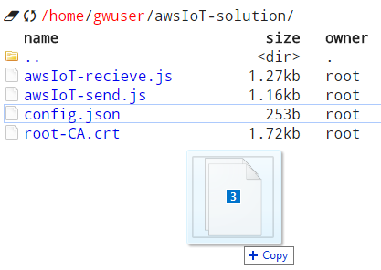

In Node Red, you should now see the aws-mqtt node that you installed earlier.  Drag the aws node from the Output section next to the default flow.

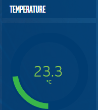

Connect the ‘F to C’ node to the ‘aws-mqtt’ node.  This will take the temperature from the RH-USB sensor and send it to the AWS Cloud.
 
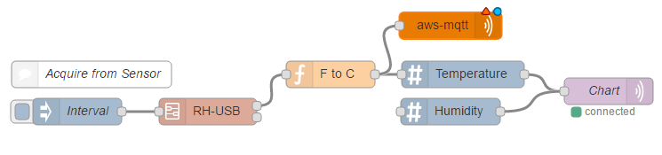
 
Now double click the 'aws-mqtt' node to configure it.  Click the pencil to add a new IoT Device:

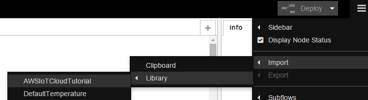

Fill out the settings based on the information in your AWS IoT browser tab that you left open earlier.  Pay special attention to the Client ID, Region and AWS Certs path.  Click Add.

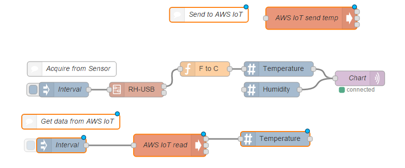

Now create an MQTT  Topic that you will send your sensor information to.  Something like /sensor/temp.  Click OK to save the aws-iot output node.

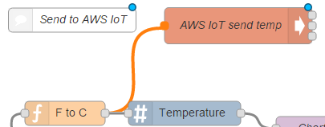

Optionally, you can also create an input node with the same Device and Topic settings and send the information to Debug. This will subscribe to the same topic that is being published to, and when there is a message posted, it will grab it and send it to the debug tab.  This is a great way to see that your message is making the round trip to the cloud and back successfully.  Obviously that subscription could also be the basis for a command and control use case, where a message that is posted to the cloud could be retrieved by the gateway and the information could be acted upon.  Make sure the topic is the same as the publishing node in this case.  It will subscribe to all messages sent to that topic.

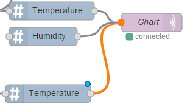

Click the Deploy button in the right corner to save the changes to the flow.

**Congratulations! You are now successfully transmitting sensor data to/from the AWS IoT Cloud**

## Creating AWS Rule ##
- Back on the AWS IoT Console, click the ‘thing’ that you created:

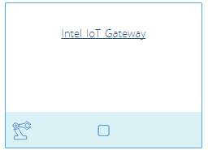

- Click on Create a rule

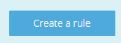

- Fill out the rule as follows

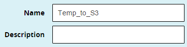

- If you would like to send all of the information you get sent to this ‘thing’, you can select all attributes and all topics as shown below

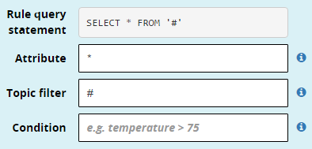

- Choose to store the data in a file in S3

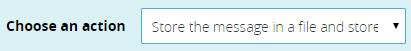

- Click to create a new bucket if you do not already have one

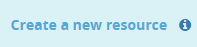

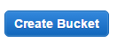

- Name the bucket with a unique name and choose it from the list.  Put the name of the file that will be stored in S3 as the Key

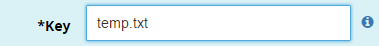

- Create a new role

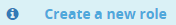

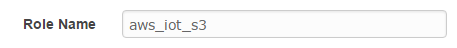

- Click Allow to create a new role

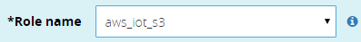

- Click on Add action to create the Rule

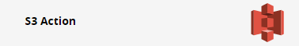

## Verifying Rule ##
- Click to go to your AWS S3 console at [https://aws.amazon.com/s3/](https://aws.amazon.com/s3/)

- Open the bucket that you created and the file name that you put as the ‘Key’.  Verify that the latest temperature is in that file.

## References ##
-   [AWS IoT](https://aws.amazon.com/iot/)
-   [Node-RED](http://nodered.org/)

*indicates that third-party names might be the property of others.
