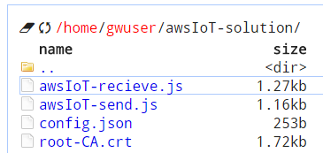
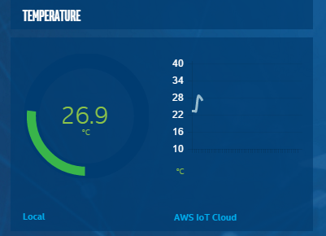

# Getting Started with Node-Red and AWS IoT #
<cr>

## Overview ##
Node-RED is a tool for wiring together hardware devices, APIs and online
services in new and interesting ways. Node-RED provides a browser-based
flow editor that makes it easy to wire together flows using the wide
range nodes in the palette. Flows can be then deployed to the run-time in
a single-click. The light-weight run-time is built on Node.js, taking
full advantage of its event-driven, non-blocking model. This makes it
ideal to run at the edge of the network. Amazon* Web Services (AWS IoT) is a managed cloud platform that lets connected devices easily and securely interact with cloud applications and other devices. AWS IoT can support billions of devices and trillions of messages, and can process and route those messages to AWS endpoints and to other devices reliably and securely. With AWS IoT, your applications can keep track of and communicate with all your devices, all the time, even when they aren’t connected.  AWS IoT makes it easy to use AWS services like AWS Lambda, Amazon Kinesis, Amazon S3, Amazon Machine Learning, and Amazon DynamoDB to build IoT applications that gather, process, analyze and act on data generated by connected devices, without having to manage any infrastructure.

## Required Hardware ##
-   IoT Gateway that uses Intel® IoT Gateway Technology

## Assumptions ##
-   Intel® IoT Gateway Technology version 3.1 or above
-   Node.js is installed on the IoT Gateway (installed by default)
-   Node-RED node node-red-node-serialport is installed on the IoT Gateway (installed by default)
- AWS IoT package is installed on the IoT Gateway 
	- You can install this package by clicking on Packages and then Add Packages from the Intel® IoT Gateway Developer Hub
-   Node-RED is installed on the IoT Gateway and is running (installed by default)

## Setting up AWS IoT ##
- Sign up for a new AWS IoT account by logging in with your existing Amazon account or creating a new one by visiting [https://aws.amazon.com/iot/]( https://aws.amazon.com/iot/)

- Click to start the interactive tutorial after you log in.

- Read through the first part of the tutorial that explains the different parts of the solution (Steps 1–6).  When you are done with that you will be prompted to create a thing:

- Click on View Thing

- Click on Connect a device:

- Choose the NodeJS SDK and then click Generate certificate and policy

- Click to download the public key, private key and the certificate to your local computer.  Place them in a directory where you can find them in a future step.  These certificates are what authenticate the IoT gateway and allow it to send data to the AWS IoT cloud.

- Copy the text in the box to your clipboard.  This data is specific to your configuration and will be used by the IoT gateway to know how to talk to your account.

- Click Return to Thing Detail

## Setting up the Node-RED Flow ##

- Navigate to the Intel® IoT Gateway Developer Hub.  Log in and click administration and then launch Cloud Commander from the quick tools section on the Administration tab.

- Navigate to the /home/gwuser/awsIoT-solution/ directory

- Open the config.json file for editing by right clicking it and choosing Edit

- Paste the contents of your clipboard into the config.json file, overwriting the defaults

- Press ESC and select OK to save changes to the file:

- Open the folder that you used earlier to download the public key, private key and certificate.  Position your windows so that you can drag those three files on the file editor window to copy them to the IoT gateway.

- If not already connected, the RH-USB sensor to the IoT gateway.  You should see the gauge go live on the IoT Developer Hub dashboard.

- Click back on the Administration tab in the Intel IoT Developer Hub.  Click on the Node Red icon under quick tools to open the visual programming interface

- Import the AWS IoT Cloud Tutorial from the Node-RED Library

- Position the nodes next to the existing RH-USB sensor flow

- Connect the ‘F to C’ node to the ‘AWS IoT send temp’ node.  This will take the temperature from the RH-USB sensor and send it to the AWS Cloud.
 

- Connect the ‘Temperature’ charting node to the ‘Chart’ node.  This will get the temperature back from AWS IoT and chart it on the IoT gateway.  The data will make the round trip to the cloud before getting charted.

- Click the Deploy button in the right corner to save the changes to the flow.

Check to the IoT Dev Hub dashboard to ensure that the chart reflects the  flow from the cloud data:

**Congratulations! You are now successfully transmitting sensor data to/from the AWS IoT Cloud**

## Creating AWS Rule ##
- Back on the AWS IoT Console, click the ‘thing’ that you created:

- Click on Create a rule

- Fill out the rule as follows

- If you would like to send all of the information you get sent to this ‘thing’, you can select all attributes and all topics as shown below

- Choose to store the data in a file in S3

- Click to create a new bucket if you do not already have one

- Name the bucket with a unique name and choose it from the list.  Put the name of the file that will be stored in S3 as the Key

- Create a new role

- Click Allow to create a new role

- Click on Add action to create the Rule

## Verifying Rule ##
- Click to go to your AWS S3 console at [https://aws.amazon.com/s3/](https://aws.amazon.com/s3/)

- Open the bucket that you created and the file name that you put as the ‘Key’.  Verify that the latest temperature is in that file.

## References ##
-   [AWS IoT](https://aws.amazon.com/iot/)
-   [Node-RED](http://nodered.org/)

*indicates that third-party names might be the property of others.