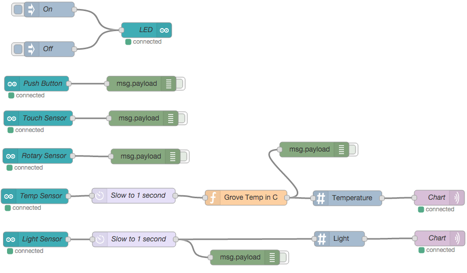

# Getting Started with Node-RED and Arduino 101 with the Grove Shield #
<cr>

## Overview ##
Node-RED is a tool for wiring together hardware devices, APIs and online
services in new and interesting ways. Node-RED provides a browser-based
flow editor that makes it easy to wire together flows using the wide
range nodes in the palette. Flows can be then deployed to the run-time in
a single-click. The light-weight run-time is built on Node.js, taking
full advantage of its event-driven, non-blocking model. This makes it
ideal to run at the edge of the network. Arduino 101 is the ideal successor of the UNO, updated with the latest technologies including the Intel(R) Curie(TM) processor.  It recognizes gestures and features a six-axis accelerometer and gyroscope.  Grove is a modulated, ready-to-use tool set. Much like Lego, it takes a building block approach to assembling electronics. Compared with the traditional, complicated learning method of using a breadboard and various electronic components to assemble a project, Grove simplifies and condenses the learning process significantly. The Grove system consists of a base shield and various modules with standardized connectors. The base shield allows for easy connection of any microprocessor input or output from the Grove modules, and every Grove module addresses a single function, such as a simple button or a more complex heart rate sensor. Each one comes with clear documentation and demo code to help you get started quickly.

## Required Hardware ##
-   IoT Gateway that uses Intel® IoT Gateway Technology
-   Arduino* 101
-	Grove* Shield kit


## Assumptions ##
-   Intel® IoT Gateway Technology version 3.1 or above
-   Node.js is installed on the IoT Gateway (installed by default)
-   Node-RED node node-red-node-serialport is installed on the IoT Gateway (installed by default)
- Node-Red-Node_Arduino node is installed on the IoT Gateway 
	- You can install this package by clicking on Packages and then Add Packages from the Intel® IoT Gateway Developer Hub
-   Node-RED is installed on the IoT Gateway and is running (installed by default)

## Preparing and connecting the Arduion 101 with Grove Shield ##
-	These steps need to be done from a 2nd system, not the IoT gateway.  In this case, we've running Windows.
-	Install the latest version of Arduino IDE from http://arduino.com
-	Plug in the Arduino 101 and set the IDE to the correct port and board type
-	Load the StandardFirmata sketch from File/Examples/Firmata
	-	As of 1/4/16 (IDE version 1.6.7), the example StandardFirmata sketch would not compile for the Arduino 101 due to missing board reference in the board.h file.  This issue may be fixed by now but if not, an updated board.h file can be found [here](https://github.com/firmata/arduino/blob/master/Boards.h).  Copy this file to C:\Program Files (x86)\Arduino\libraries\Firmata
-	Upload the Example
	-	As of 1/4/16, the IDE will time out trying to communicate with the Arduino 101 during upload.  To workaround this issue, just press the reset button between the USB and Power ports on the Arduino 101 right after you start the upload process.
-	The sketch should compile and upload.  You may see some warnings about SET_PIN_MODE.  These are known issues and can be ignored for this example.
-	Unplug the Arduino 101 and install the Grove Shield.
-	For this example, we'll be using 6 of the sensors from the Grove Shield kit.  Please connect them as follows:
	-	LED to D2
	-	Push Button to D3
	-	Touch Sensor to D6
	-	Temp Sensor to A0
	-	Light Sensor to A1
	-	Rotary Sensor to A2

## Connecting the Arduino 101 ##
Plug the Arduino 101 in to power
Plug the Arduino 101 in to a USB port on your IoT Gateway. On
the console of the IoT gateway you should see a message saying what serial
device was created for the USB interface (it is likely /dev/ttyACM0).
Please make a note of what device was created.

## Using Node-RED ##
The Node-RED browser interface can be reached via
<http://ipaddressofthegateway:1880>. When it first comes up it will look
something like this.


Node-RED supports exporting and importing of flows (into source json).
Below is an export an several example flows we created. If you hightlight and copy this and then import it in to Node-RED, the same nodes and configuration we created manually will automatically appear on the selected Sheet. Import and Export can be found in the Node-RED menu by clicking on the 3 horizontal lines to the right of the Deploy button.

Example flow

```
 
	[{"id":"baabe7c7.455418","type":"mqtt-broker","z":"","broker":"localhost","port":"1883","clientid":"","usetls":false,"verifyservercert":true,"compatmode":true,"keepalive":"15","cleansession":true,"willTopic":"","willQos":"0","willRetain":"false","willPayload":"","birthTopic":"","birthQos":"0","birthRetain":"false","birthPayload":""},{"id":"32658631.cd9a7a","type":"arduino-board","z":"20d54c58.df2ab4","device":"/dev/ttyACM0"},{"id":"fa2205e3.05ddf8","type":"arduino in","z":"20d54c58.df2ab4","name":"Rotary Sensor","pin":"2","state":"ANALOG","arduino":"32658631.cd9a7a","x":100,"y":356,"wires":[["92255d0.f6ddaa"]]},{"id":"647e1222.9b81ec","type":"arduino out","z":"20d54c58.df2ab4","name":"LED","pin":"2","state":"OUTPUT","arduino":"32658631.cd9a7a","x":314,"y":77,"wires":[]},{"id":"b001dba5.4ffe28","type":"inject","z":"20d54c58.df2ab4","name":"On","topic":"","payload":"1","payloadType":"string","repeat":"","crontab":"","once":false,"x":120,"y":36,"wires":[["647e1222.9b81ec"]]},{"id":"213f0e7.fdec0f2","type":"inject","z":"20d54c58.df2ab4","name":"Off","topic":"","payload":"0","payloadType":"string","repeat":"","crontab":"","once":false,"x":120,"y":115,"wires":[["647e1222.9b81ec"]]},{"id":"46963aa5.b969c4","type":"arduino in","z":"20d54c58.df2ab4","name":"Push Button","pin":"3","state":"INPUT","arduino":"32658631.cd9a7a","x":99,"y":213,"wires":[["59066592.a6f99c"]]},{"id":"59066592.a6f99c","type":"debug","z":"20d54c58.df2ab4","name":"","active":false,"console":"false","complete":"false","x":307,"y":214,"wires":[]},{"id":"f7ffe9f7.080018","type":"arduino in","z":"20d54c58.df2ab4","name":"Temp Sensor","pin":"0","state":"ANALOG","arduino":"32658631.cd9a7a","x":96,"y":459,"wires":[["7d6d35a2.8292cc"]]},{"id":"620f1f9a.9df0e","type":"debug","z":"20d54c58.df2ab4","name":"","active":false,"console":"false","complete":"false","x":602,"y":433,"wires":[]},{"id":"80ac1a25.7f53e8","type":"arduino in","z":"20d54c58.df2ab4","name":"Touch Sensor","pin":"6","state":"INPUT","arduino":"32658631.cd9a7a","x":111,"y":281,"wires":[["6ce29b01.931d64"]]},{"id":"6ce29b01.931d64","type":"debug","z":"20d54c58.df2ab4","name":"","active":true,"console":"false","complete":"false","x":319,"y":282,"wires":[]},{"id":"b8823228.477dd","type":"arduino in","z":"20d54c58.df2ab4","name":"Light Sensor","pin":"1","state":"ANALOG","arduino":"32658631.cd9a7a","x":95,"y":622,"wires":[["64bf7eab.9b408"]]},{"id":"f1d069d8.0e2f98","type":"debug","z":"20d54c58.df2ab4","name":"","active":false,"console":"false","complete":"false","x":487,"y":622,"wires":[]},{"id":"92255d0.f6ddaa","type":"debug","z":"20d54c58.df2ab4","name":"","active":false,"console":"false","complete":"false","x":334,"y":357,"wires":[]},{"id":"7d6d35a2.8292cc","type":"delay","z":"20d54c58.df2ab4","name":"Slow to 1 second","pauseType":"rate","timeout":"1","timeoutUnits":"seconds","rate":"1","rateUnits":"second","randomFirst":"1","randomLast":"5","randomUnits":"seconds","drop":true,"x":294,"y":504,"wires":[["b5594fda.4aa6b"]]},{"id":"b5594fda.4aa6b","type":"function","z":"20d54c58.df2ab4","name":"Grove Temp in C","func":"// Convert Grove Temperature to Celsius\n// Based on http://www.seeedstudio.com/wiki/Grove_-_Temperature_Sensor\n\nvar a = parseInt(msg.payload);\nvar t = 1/(Math.log((1023-a)/a)/3975+1/298.15)-273.15;\n\nmsg.payload = t.toFixed(2);\n\nreturn msg;","outputs":1,"noerr":0,"x":532,"y":537,"wires":[["620f1f9a.9df0e","b5f6512e.4a09b"]]},{"id":"64bf7eab.9b408","type":"delay","z":"20d54c58.df2ab4","name":"Slow to 1 second","pauseType":"rate","timeout":"1","timeoutUnits":"seconds","rate":"1","rateUnits":"second","randomFirst":"1","randomLast":"5","randomUnits":"seconds","drop":true,"x":285,"y":652,"wires":[["f1d069d8.0e2f98","14099a6d.ebf666"]]},{"id":"b5f6512e.4a09b","type":"chart tag","z":"20d54c58.df2ab4","title":"Temperature","chartType":"gauge","dataSource":"Grove","units":"°C","min":"0","max":"100","targetLow":"","targetHigh":"","priority":"1","sourcePriority":"1","ttl":"5","points":"50","x":710,"y":485,"wires":[["8f6b7352.70949"]]},{"id":"8f6b7352.70949","type":"mqtt out","z":"20d54c58.df2ab4","name":"Chart","topic":"/sensors","qos":"","retain":"","broker":"baabe7c7.455418","x":874,"y":504,"wires":[]},{"id":"14099a6d.ebf666","type":"chart tag","z":"20d54c58.df2ab4","title":"Light","chartType":"gauge","dataSource":"Grove","units":"°C","min":"0","max":"100","targetLow":"","targetHigh":"","priority":"1","sourcePriority":"1","ttl":"5","points":"50","x":620,"y":689,"wires":[["3953e7c2.c6ac18"]]},{"id":"3953e7c2.c6ac18","type":"mqtt out","z":"20d54c58.df2ab4","name":"Chart","topic":"/sensors","qos":"","retain":"","broker":"baabe7c7.455418","x":784,"y":708,"wires":[]}]
```

Once imported, it should look something like this.



-	Before you Deploy it, double-click on any of the Arduino nodes, click on the pen icon, and ensure the Port is set to the port you noted when you plugged the Arduino 101 in to the IoT Gateway.  Click on Update and Ok.
-	Click on the Deploy button; top right.
-   Ensure the “debug” node is turned on. The box extending to the right of the debug should be solid/filled in green.
-   After a moment, you should see a green indicator and the word connected appear under each Arduino node.
-   Try turning on the debug node for the Temp sensor by click on the green bock to the right of each debug node.  You should see the temperature reading appear in the debug tab every second.
-   Try turning on the debug node for the Light sensor by click on the green bock to the right of each debug node.  You should see the light reading appear in the debug tab every second.
-   Ensure the debug nodes are turned on for the Push Button, Touch, and Rotary Sensor flows by click on the green bock to the right of each debug node.
-	Try pressing the push button, touch sensor, and or turning the rotary sensor and see the values appear in the debug tab.
- Now view the Intel® IoT Gateway Developer Hub via a web browser.  You should see a new sensors and graphs for the Grove Temperature sensor and Grove Light Sensor.

**Congratulations! You are successfully communicating via to multiple sensors on the Grove Shield attached to an Arduino 101.**

## References ##
-   [Arduino 101](https://www.arduino.cc/en/Main/ArduinoBoard101)
-	[Grove Shield Kit for Arduino](http://www.seeedstudio.com/depot/Grove-Starter-Kit-for-Arduino-p-1855.html)
-   [Node-red-node-Arduino](http://nodered.org/docs/hardware/arduino.html)
-   [Node-RED](http://nodered.org/)

*indicates that third-party names might be the property of other

