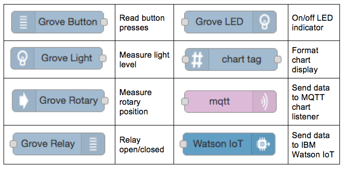
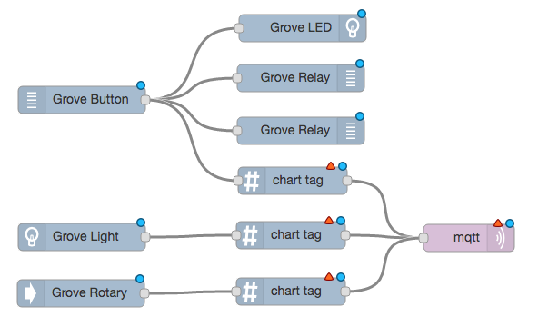
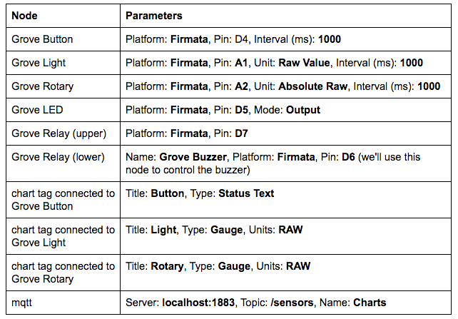

# Getting Started with Node-RED and Arduino 101 with the Grove Shield #
<cr>

## Overview ##
Node-RED is a tool for wiring together hardware devices, APIs and online
services in new and interesting ways. Node-RED provides a browser-based
flow editor that makes it easy to wire together flows using the wide
range nodes in the palette. Flows can be then deployed to the run-time in
a single-click. The light-weight run-time is built on Node.js, taking
full advantage of its event-driven, non-blocking model. This makes it
ideal to run at the edge of the network. Arduino 101 is the ideal successor of the UNO, updated with the latest technologies including the Intel(R) Curie(TM) processor.  It recognizes gestures, and features a six-axis accelerometer and gyroscope.  Grove is a modulated, ready-to-use tool set. Much like Lego, it takes a building block approach to assembling electronics. Compared with the traditional, complicated learning method of using a breadboard and various electronic components to assemble a project, Grove simplifies and condenses the learning process significantly. The Grove system consists of a base shield and various modules with standardized connectors. The base shield allows for easy connection of any microprocessor input or output from the Grove modules, and every Grove module addresses a single function, such as a simple button or a more complex heart rate sensor. Each one comes with clear documentation and demo code to help you get started quickly.

## Required Hardware ##
-   IoT Gateway that uses Intel® IoT Gateway Technology
-   Arduino* 101
-	Grove* Shield kit

## Assumptions ##
-   Intel® IoT Gateway Technology version 3.1 or above
-   Node.js is installed on the gateway (installed by default)
-   Node-RED is installed on the gateway and is running (installed by default)
-	MRAA, UPM, and node-red-contrib-upm node is installed on the IoT Gateway 
	- You can install these packages by clicking on Packages and then Add Packages from the Intel® IoT Gateway Developer Hub

## Preparing and connecting the Arduion 101 with Grove Shield ##
-	Arduino 101 connected to the Intel® IoT Gateway through USB
-	Grove Base Shield attached to Arduino 101 and switched to 3V3 VCC
-	For this example, we'll be using 6 of the sensors from the Grove Shield kit.  Please connect them as follows:
	-	LED to D2
	-	Push Button to D3
	-	Touch Sensor to D6
	-	Temp Sensor to A0
	-	Light Sensor to A1
	-	Rotary Sensor to A2

## Connecting the Arduino 101 ##
Plug in an Arduino 101* board and reboot your gateway.
The Firmata* sketch should now beflashed onto Arduino 101*, and you are now ready.

## Using Node-RED ##
The Node-RED browser interface can be reached via
<http://ipaddressofthegateway:1880>. When it first comes up it will look
something like this.

Along the left side of the Node-RED screen you'll see a series of nodes. These are the building blocks for creating a Node-RED application on the Intel® IoT Gateway. We'll use several nodes in this application:

Drag and drop nodes onto the canvas and arrange them as shown below. For some of the nodes we'll need multiple copies. Use your mouse to connect wires between the nodes as shown. We'll use the Watson IoT node later so don't include it for now.

When nodes are first placed on the canvas they are in a default state and need to be configured before they'll work. Nodes are configured by double-clicking them and setting parameters in their configuration panels.

Double-click each node on the canvas and set its parameters as shown in the table below. In some cases the Name field is left blank to use the default name of the node. Pin numbers correspond to the Grove Base Shield jack where the sensor or actuator is connected.

Verify your settings and wiring connections, then click the Deploy button to deploy your changes and make them active on the gateway. After deploying the flow, you should see a data display towards the top of the Intel® IoT Gateway Developer Hub screen with live values for Rotary, Light and Button. Turning the rotary knob and covering the light sensor should make the numbers change up and down, and pressing the button should turn on the LED, sound the buzzer, and energize the relay.

**Congratulations! You are successfully communicating via to multiple sensors on the Grove Shield attached to an Arduino 101.**

## References ##
-   [Arduino 101*](https://www.arduino.cc/en/Main/ArduinoBoard101)
-	[Grove* Shield Kit for Arduino*](http://www.seeedstudio.com/depot/Grove-Starter-Kit-for-Arduino-p-1855.html)
-   [Node-RED*](http://nodered.org/)
-   [node-red-contrib-upm](https://github.com/intel-iot-devkit/node-red-contrib-upm)

*indicates that third-party names might be the property of other
