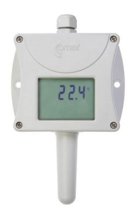
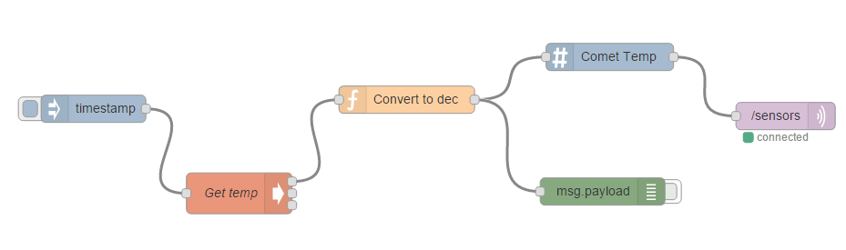

# Getting Started With Node-RED and Comet T0310 #
<cr>

## Overview ##
Node-RED is a tool for wiring together hardware devices, APIs and online
services in new and interesting ways. Node-RED provides a browser-based
flow editor that makes it easy to wire together flows using the wide
range nodes in the palette. Flows can be then deployed to the run-time in
a single-click. The light-weight run-time is built on Node.js, taking
full advantage of its event-driven, non-blocking model. This makes it
ideal to run at the edge of the network. The Comet* T0310 is an Ambient temperature transmitter for outdoor & indoor use. The temperature transmitter is built in a durable watertight case. Degrees Celsius and Fahrenheit are user selectable.

## Required Hardware ##
-   IoT Gateway that uses Intel® IoT Gateway Technology
-   Comet T0310 sensor



## Assumptions ##
-   Intel® IoT Gateway Technology version 3.1 or above
-   Node.js is installed on the IoT Gateway (installed by default)
-   Node-RED node node-red-node-serialport is installed on the IoT Gateway (installed by default)
- Modbus libraries, libmodbus and libmodbus-dev, are installed on the Intel IoT Gateway 
	- You can install this package by clicking on Packages and then Add Packages from the Intel® IoT Gateway Developer Hub
-	Node-RED is installed on the IoT Gateway and is running (installed by default)

## Connecting the Comet T0310 Sensor ##
-	Plug the Comet T0310 sensor in to a serial port on the IoT Gateway.
-	Plug the Comet T0310 sensor in to power.  

## Disabling the Serial Getty ##
By default, the Linux operating system on the IoT Gateway redirects console output to the serial port.  This needs to be disabled so the serial port can be used for the sensor.

From the console, log in and enter these commands:
-	systemctl disable serial-getty@ttyS0
-	systemctl stop serial-getty@ttyS0

## Installing sample code to read temperature ##
Below is the source code for reading from the Comet sensor [readtempfromcomet.c](src/readtempfromcomet.c):

```

    /*
    * Copyright (c) 2015 Intel Corporation.
    *
    * Permission is hereby granted, free of charge, to any person obtaining
    * a copy of this software and associated documentation files (the
    * "Software"), to deal in the Software without restriction, including
    * without limitation the rights to use, copy, modify, merge, publish,
    * distribute, sublicense, and/or sell copies of the Software, and to
    * permit persons to whom the Software is furnished to do so, subject to
    * the following conditions:
    *
    * The above copyright notice and this permission notice shall be
    * included in all copies or substantial portions of the Software.
    *
    * THE SOFTWARE IS PROVIDED "AS IS", WITHOUT WARRANTY OF ANY KIND,
    * EXPRESS OR IMPLIED, INCLUDING BUT NOT LIMITED TO THE WARRANTIES OF
    * MERCHANTABILITY, FITNESS FOR A PARTICULAR PURPOSE AND
    * NONINFRINGEMENT. IN NO EVENT SHALL THE AUTHORS OR COPYRIGHT HOLDERS BE
    * LIABLE FOR ANY CLAIM, DAMAGES OR OTHER LIABILITY, WHETHER IN AN ACTION
    * OF CONTRACT, TORT OR OTHERWISE, ARISING FROM, OUT OF OR IN CONNECTION
    * WITH THE SOFTWARE OR THE USE OR OTHER DEALINGS IN THE SOFTWARE.
    */
    
    
    #include <stdio.h>
    #include <errno.h>
     
    #include </usr/include/modbus/modbus.h>
     
    int main() 
    {
     
    modbus_t *mb;
    uint16_t tab_reg[32];
    int rc;
     
    mb = modbus_new_rtu("/dev/ttyS0", 9600, 'N', 8, 1);
    if (mb == NULL) {
    	fprintf(stderr, "Unable to create the libmodbus context\n");
    	return -1;
    }
    
    	//modbus_set_debug(mb, TRUE); 
    
    rc = modbus_set_slave(mb, 1);
    if (rc != 0) {
    fprintf(stderr, "set slave failed: %s\n", modbus_strerror(errno));
    modbus_free(mb);
    return -1;
    }
    
    modbus_rtu_set_serial_mode(mb, MODBUS_RTU_RS232);
    rc = modbus_connect(mb);
    if (rc != 0) {
    fprintf(stderr, "Connection failed: %s\n", modbus_strerror(errno));
    modbus_free(mb);
    return -1;
    }
    
    rc = modbus_read_registers(mb, 0x030, 1, tab_reg);
    if (rc == -1) {
    fprintf(stderr, "write failed: %d %s\n", errno, modbus_strerror(errno));
    modbus_free(mb);
    return -1;
    }
    printf("%d\n", tab_reg[0]);
    
    modbus_close(mb);
    modbus_free(mb);
    
    return 0;
    }
```

Copy the source file [readtempfromcomet.c](src/readtempfromcomet.c) from this GitHub repo to the /home/gwuser folder on the IoT Gateway.
The code assumes the sensor is plugged in to serial port1 (/dev/ttyS0).  If not, edit the source and change line 13 accordingly.
To compile, enter: 
>gcc readtempfromcomet.c –o readtempfromcomet –lmodbus

To test the complied code, execute as follows:
>./readtempfromcomet


You should get back a 3 digit number, like 733.  That's the current temperate in Fahrenheit without the decimal point.


## Using Node-RED ##
The Node-RED browser interface can be reached via
<http://ipaddressofthegateway:1880>. When it first comes up it will look
something like this.


Let’s create a Node-RED flow to get the temperature reading from the Comet T3010 sensor.

Drag the following nodes from the left bar on to Sheet 1

-   inject
-   exec
-   function
-   chart tag
-   debug
-   mqtt

Now, configure the nodes

-   Double click on the exec node and set the fields as follows:
	-   Command = /home/gwuser/readtempfromcomet
	-   Name = Get temp
	-   Click on Ok
-   Double click on the function node and paste in this code:

		msg.payload = msg.payload * .10;
		return msg;

	- Set the Name to Convert to dec
	- Click on Ok
- Double click on the chart node and set the fields as follows:
	- Title = Comet Temp
	- Type = Line
	- Series = Temperature
	- Units = blank
	- Range = 70 to 80
	- Target = 72 to 76
	- Points = 50
	- Source = Local Comet Sensor
	- Click on Ok
-Double click on the mqtt node and set the fields as follows:
	- Server = localhost:1883 (this should be selectable in the drop down
	- Topic = /sensors
	- Click on Ok

Now we need to wire the nodes together

-   Now wire the inject node to the Get temp node by clicking and dragging between the small box on the right of the inject node to the small box on the left of the Get temp node.
- Repeat the process connecting
	-  Get temp to Convert to dec
	-  Convert to dec to Comet Temp and debug
	-  Comet Temp to mqtt
	
 It should look like this:




-   Click on the Deploy button; top right.
-   Ensure the “debug” node is turned on. The box extending to the right of the debug should be solid/filled in green.
-   Switch the column on the right from the Info tab to the debug tab.
-   Click on the solid/filled in light blue box on the left side of the inject node.
    -   You should see the current temperature in Fahrenheit returned in the debug tab. It should look like this:

[](images/image4.png)

-   In addition, the temperature data should now show up on the IoT Gateway Developer Hub.

**Congratulations! You are successfully communicating via ModBus over Serial to the Comet T0310 Temperature Sensor.**

## Example flow ##
Node-RED supports exporting and importing of flows (into source json).
Here is an export of the above two flows we created. If you import this,
the same nodes and configuration we created manually will automatically
appear on the selected Sheet. Import and Export can be found in the
Node-RED menu by clicking on the 3 horizontal lines to the right of the
Deploy button.

    [{"id":"586f4212.a790bc","type":"mqtt-broker","broker":"localhost","port":"1883","clientid":""},{"id":"677876fb.988788","type":"exec","z":"32116d32.cdee92","command":"/home/gwuser/readtempfromcomet","addpay":true,"append":"","useSpawn":"","name":"Get temp","x":305.6666259765625,"y":293.6666564941406,"wires":[["cc6fcc16.33903"],[],[]]},{"id":"5de42238.a21bdc","type":"inject","z":"32116d32.cdee92","name":"","topic":"","payload":"","payloadType":"date","repeat":"5","crontab":"","once":false,"x":145.6666259765625,"y":200.66665649414062,"wires":[["677876fb.988788"]]},{"id":"cc6fcc16.33903","type":"function","z":"32116d32.cdee92","name":"Convert to dec","func":"msg.payload = msg.payload * .10;\nreturn msg;","outputs":1,"noerr":0,"x":489.6666259765625,"y":190.66665649414062,"wires":[["4b862853.b479d8","cd034d62.32fcb"]]},{"id":"4b862853.b479d8","type":"chart tag","z":"32116d32.cdee92","title":"Comet Temp","chartType":"line","dataSource":"local","series":"Temperature","units":"","min":"70","max":"80","targetLow":"72","targetHigh":"76","points":50,"x":712.6666259765625,"y":143.66665649414062,"wires":[["4fd2ad2b.b02d54"]]},{"id":"4fd2ad2b.b02d54","type":"mqtt out","z":"32116d32.cdee92","name":"","topic":"/sensors","qos":"","retain":"","broker":"586f4212.a790bc","x":905.6666259765625,"y":208.66665649414062,"wires":[]},{"id":"cd034d62.32fcb","type":"debug","z":"32116d32.cdee92","name":"","active":false,"console":"false","complete":"false","x":704.6666259765625,"y":291.6666564941406,"wires":[]}]


## References ##
-   [Comet T0310 Temperature Sensor](http://www.cometsystem.com/products/t0310-temperature-transmitter-with-rs232-output/reg-T0310)
-   [Node-red-node-serialport](http://flows.nodered.org/node/node-red-node-serialport)
-   [Node-RED](http://nodered.org/)

*indicates that third-party names might be the property of others.