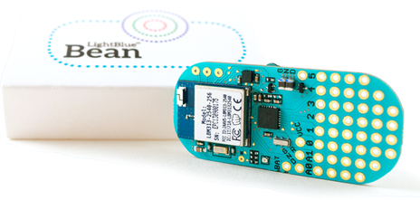
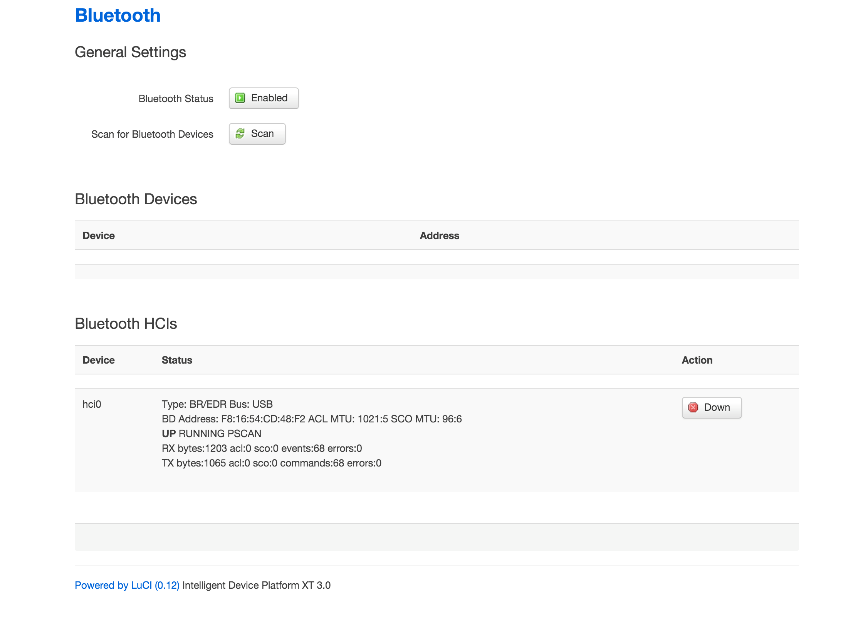
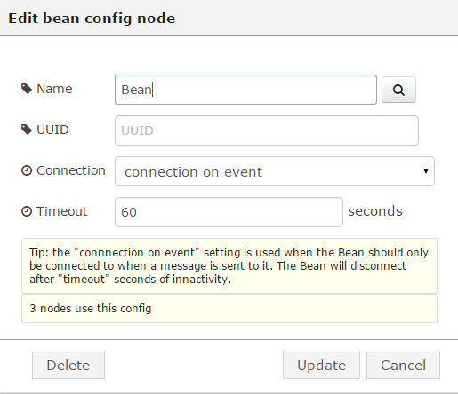
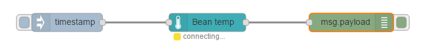

# Getting Started With Node-RED and LightBlue* Bean #
<cr>

## Overview ##
Node-RED is a tool for wiring together hardware devices, APIs and online services in new and interesting ways. Node-RED provides a browser-based flow editor that makes it easy to wire together flows using the wide range nodes in the palette. Flows can be then deployed to the run-time in a single-click. The light-weight run-time is built on Node.js, taking full advantage of its event-driven, non-blocking model. This makes it ideal to run at the edge of the network. The LightBlue* Bean is a low energy Bluetooth Arduino microcontroller. Using Bluetooth 4.0, it is programmed wirelessly, runs on a coin cell battery, and comes with Temperature and 3-axis accelerometer sensors onboard, multi-color LED, and 6 digital I/O pins, 2 analog pins.

## Required Hardware ##
-   IoT Gateway that uses Intel® IoT Gateway Technology
-   LightBlue Bean

## Assumptions ##
-   Intel® IoT Gateway Technology version 3.1 or above
-   Node.js is installed on the IoT Gateway (installed by default)
-   Node-RED node node-red-contrib-bean is installed on the Intel IoT Gateway
	- You can install this package by clicking on Packages and then Add Packages from the Intel® IoT Gateway Developer Hub
-   Node-RED is installed on the IoT Gateway and is running (installed by default)

## Enabling Bluetooth Low Energy (BLE) on the IoT Gateway ##
By default, Bluetooth is enabled but Bluetooth Low Energy (BLE) is not.
This is easy to turn off via the IoT Gateway administrative web
console. You can access the console via <http://ipaddressofthegateway>.

-   Log in using your root username and password
-   Click on the Administration icon and then the Lunch button under LuCI to launch the IoT gateway administration console.
-   Log in using your root username and password.
-   Select Network from the menu and choose Bluetooth
-   If it says “Disabled” next to Bluetooth Status, click on the Disabled button
-	It should look like this when setup correctly

## Bluetooth Test ##
Before we start, let’s make sure the IoT Gateway can discover the LightBlue Bean device. Ensure a battery is installed in the Bean and type the following on the IoT Gateway console prompt: 

>hcitool lescan

It should respond with something like this:

>LE Scan …
>
>B4:99:4C:1E:C0:C0 Bean

It may also show other Bluetooh devices in range
Press Ctrl-C to stop the scanning tool. If it doesn’t show your Bean, try removing the battery from your Bean, reinserting it, and trying the hcitool again.

## Using Node-RED ##
The Node-RED browser interface can be reached via
<http://ipaddressofthegateway:1880>. When it first comes up it will look
something like this.

Let’s create a Node-RED flow to get the current temperature from the
Bean.

Drag the following nodes from the left bar on to Sheet 1

-   inject
-   Bean temperature
-   Debug

Now, configure the nodes:

-   Double click on the temperature node and click on the pen icon to add a Bean. Set the name to Bean. Leave the UUID blank (if you have more than 1 Bean, you can set this to the MAC address of the Bean you want to talk to. For this example, we’ll assume there is only one in range. Leave the other fields as default. For example:

-   Click on Add and then OK
-   Now wire the inject node to the Bean node by clicking and dragging between the small box on the right of the inject node to the small box on the left of the Bean node.
-   Repeat the wire process connecting the Bean node to the debug node
-   It should look like this:

-   Click on the Deploy button, top right, and Confirm deploy.
-   Ensure the “debug” node is turned on. The box extending to the right of the node should be solid/filled in green.
-   Switch the column on the right from the Info tab to the debug tab.
-   Click on the solid/filled in light blue box on the left side of the inject node.
-   The text under the bean node should say connected and the current temperature should appear in the debug tab.

**Congratulations! You are successfully communicating via BlueTooth low energy to a LightBlue Bean device.**

You can use the same process to read the accelerometer, turn on the LED, change the color of the LED, and more. 

For more details on possible Node-RED flows with the LightBlue Bean, please visit the sample projects page on the [LightBlue Bean website](http://legacy.punchthrough.com/bean/node-red-example-projects/).

## Example flow ##
Node-RED supports exporting and importing of flows (into source json).
Here is an export of the above two flows we created. If you import this,
the same nodes and configuration we created manually will automatically
appear on the selected Sheet. Import and Export can be found in the
Node-RED menu by clicking on the 3 horizontal lines to the right of the
Deploy button.

	[{"id":"d717de8d.28e82","type":"bean","name":"Bean","uuid":"","connectiontype":"timeout","connectiontimeout":"60"},{"id":"580e0319.a7f1fc","type":"bean temp","name":"","bean":"d717de8d.28e82","x":390,"y":231,"z":"4cb39d5b.b34c64","wires":[["b1895c9e.4e76a"]]},{"id":"b1895c9e.4e76a","type":"debug","name":"","active":true,"console":"false","complete":"payload","x":626,"y":231,"z":"4cb39d5b.b34c64","wires":[]},{"id":"e6b9cc13.19463","type":"inject","name":"","topic":"","payload":"","payloadType":"date","repeat":"","crontab":"","once":false,"x":160,"y":231,"z":"4cb39d5b.b34c64","wires":[["580e0319.a7f1fc"]]}]

## References ##
-   [LightBlue Bean](http://legacy.punchthrough.com/bean/)
-   [LightBlue Bean with Node-Red](http://legacy.punchthrough.com/bean/node-red/)
-   [Node-RED](http://nodered.org/)

*indicates that third-party names might be the property of others.

