# Getting Started With Node-Red and Microsoft Azure IoT Hub #
<cr>

## Overview ##
Microsoft Azure IoT Hub allows you to connect, monitor, and manage millions of IoT assets.  Azure is in an important service for many IoT partners and the Intel IoT Gateway integrates seamlessly with it.  This tutorial will show you how to configure your gateway to send data to Microsoft Azure IoT Hub without having to write any code.

## Required Hardware ##
-   IoT Gateway that uses Intel® IoT Gateway Technology
-   A system running a web browser.  In the case of this tutorial, we used a laptop running Windows 10 and Chrome.

## Required Steps to Complete Before This Tutorial ##
 - Your gateway should be running the latest Developer Packages as directed by [this](https://github.com/intel-iot-devkit/Intel-IoT-Gateway/tree/master/Updating%20the%20Intel%20IoT%20Gateway%20Developer%20Packages) tutorial.
 - You must have an Azure account.  You can get your free Azure account from Microsoft by following the instructions on at this [link](https://azure.microsoft.com/en-us/free/).
 - Follow the instructions at this [link](https://github.com/Azure/azure-iot-sdks/blob/master/doc/setup_iothub.md) to create the IoT Hub in your Azure account.  Tip: You should create your IoT Hub instance in the Free Tier if this is just a trial account.
 - This Tutorial uses the Device Explorer sample executable from the Azure SDK to prevent you from having to program to create a Device in your IoT Hub.  It can be downloaded and installed from this [link](https://github.com/Azure/azure-iot-sdks/releases).  Scroll down to the Downloads section and download and install **SetupDeviceExplorer.msi** on Windows.
 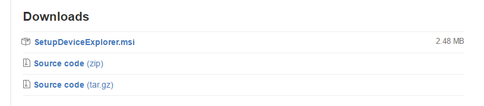

## Access The Developer Hub ##
To access the Developer Hub, open your web browser and go the <http://ipaddressofthegateway>. Log in with the username and & password.  Once connected, you should see something like this:

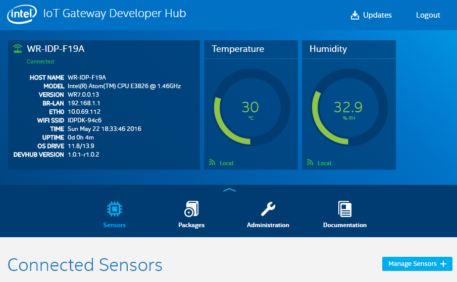

## Install the Azure SDK and the Node-Red Node on the Gateway ##

Once connected to the Developer Hub, click on the Administration tab and Launch Cloud Commander.  If you need a more in depth tutorial on how to use Cloud Commander, please refer to the that [tutorial](https://github.com/intel-iot-devkit/Intel-IoT-Gateway/tree/master/Getting%20Started%20With%20Cloud%20Commander).



Once Cloud Commander is open, scroll down to the bottom of the page and click the Console icon.



This will bring up a console where you can copy and paste the following commands to download the Azure SDK and install the Azure Node-Red Node:

Change to the home directory:
 >cd ~/
 
 Get a copy of the Azure SDK on the gateway:
 >git clone https://github.com/Azure/azure-iot-sdks
 
 Copy the Node-Red node from the SDK to the Node-Red directory on the gateway:
 >cp -r azure-iot-sdks/node/device/node-red /usr/lib/node_modules/node-red/node_modules/azure-iot 
 
 Switch to the Node-Red working directory:
 >cd /usr/lib/node_modules/node-red/node_modules/azure-iot
 
 Download the packages that are required to make the node work:
 >npm install

Once this is done, your screen should look like the following:
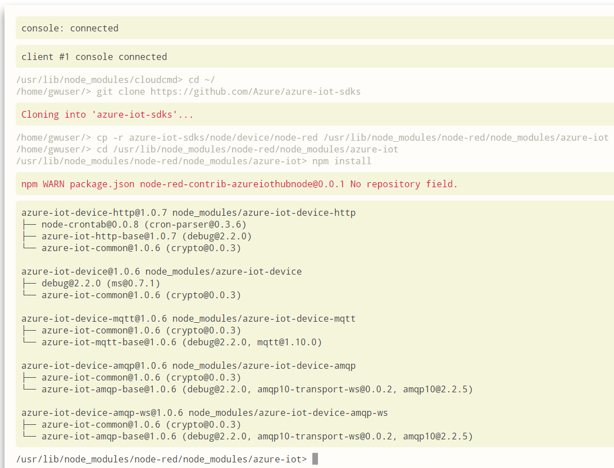

Now restart Node-Red by issuing the following commands:

>systemctl stop node-red-experience

>systemctl start node-red-experience

Alternatively you can start and stop the service from the packages tab.  It will take a few seconds to start.

## Create a Device in Azure ##

Next, bring up the Device Explorer you downloaded and installed in the required steps earlier in this tutorial.  This will allow you to create Devices in Azure without having to write code.  It will also give you an easy way to visualize the data as we send it to Azure to ensure it is getting there.

The first step requires you to get your connection string from the Azure portal to allow the Device Explorer to connect to your Azure IoT Hub instance.  This connections string should come from steps 5 and 6 of this [tutorial](https://github.com/Azure/azure-iot-sdks/blob/master/doc/setup_iothub.md) that you followed in the required steps section of this tutorial.  This is not to be confused with the device specific connection string we use later in this tutorial.

Once you have this string copied, paste it into the Device Explorer application running on a Windows machine.  Click Update to connect to that IoT Hub instance.  There is no need to fill out the Protocol Gateway HostName.

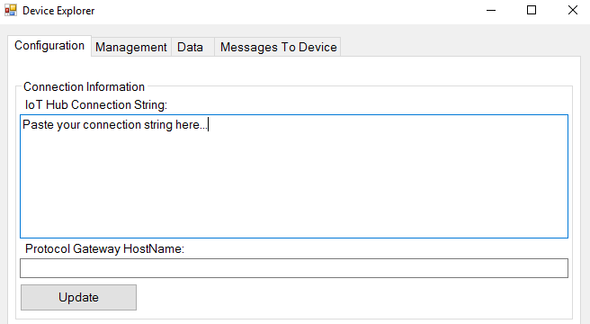

Next, Click the Management tab to create a new IoT Hub Device.  Create a new device and call it IntelIoTGateway.

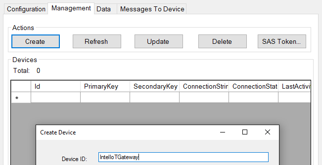

After you click Create, you should receive a message that the device has been created.  Click Done.

Now click the Data tab in the Device Explorer, ensure that your newly created Device ID is selected and click Monitor.

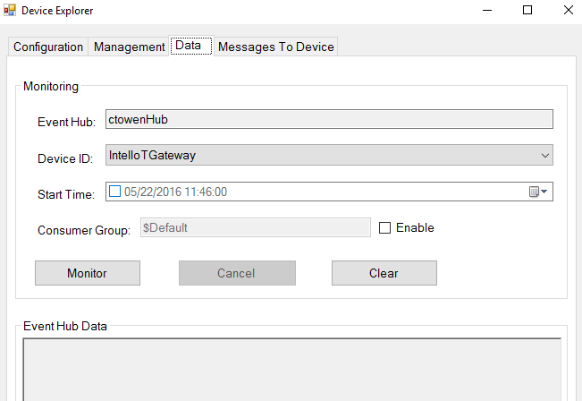

This will continue to monitor the device in the cloud as we complete the rest of the tutorial.

## Connect a Sensor to the Azure IoT Hub through the Intel IoT Gateway ##

Switch back to the Intel IoT Gateway Developer Hub interface running at the IP Address if your gateway.  Now launch Node-Red from the Administration Tab:

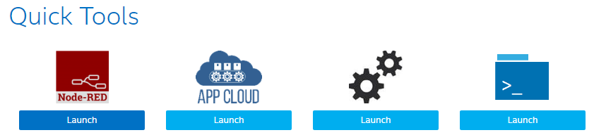

Authenticate if necessary and scroll down to the bottom left of the page of the list of Node-Red nodes that are available.  You should now see a node for Azure:

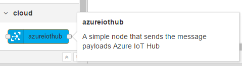

Drag this node above the default temp/humidity flow and connect it to the top output of the RH-USB node as indicated by this picture:

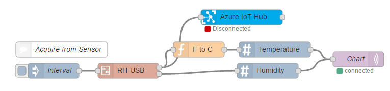

Switch back to the Device Explorer for Azure IoT Hub and copy the connection string from the device you created.  This is not to be confused with the connection string that we used earlier to connect the Device Explorer to Azure.  One is Device specific and one is not.  We need the one from the device during this step.

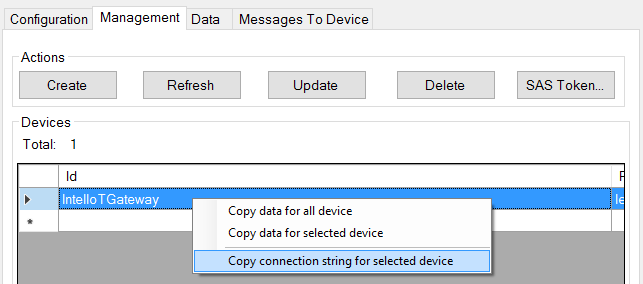

Open the Azure Node in Node-Red and paste the connection string into the Connection String textbox.

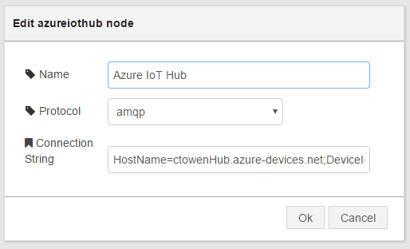

Click OK and then click Deploy in Node-Red to save the changes.

You should see that in Node-Red that the Azure node changes from Disconnected eventually to Sent Message.

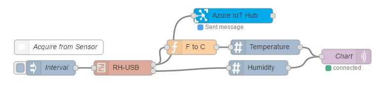

You can now switch to the Device Explorer Monitor tab and see that there are now messages flowing to your device in the Azure IoT Hub.

