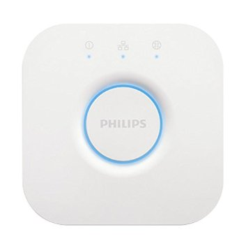
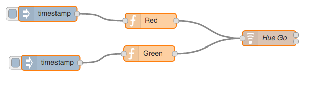

Overview
========

Node-RED is a tool for wiring together hardware devices, APIs and online services in new and interesting ways. Node-RED provides a browser-based flow editor that makes it easy to wire together flows using the wide range nodes in the palette. Flows can be then deployed to the runtime in a single-click. The light-weight runtime is built on Node.js, taking full advantage of its event-driven, non-blocking model. This makes it ideal to run at the edge of the network. Hue is Personal Wireless Lighting System from Philips. It is designed for home use and a minimum implementation includes a bridge (IP-ZigBee) and at least one LED. Most of Hue LED based lights support multi-color but pure white bulbs are available as well.

Required Hardware
=================

-   Intel Internet of Things Gateway

-   Philips Hue Bridge (version 2.0 was used in this example)

-   Philips Hue bulb or light (Philips Hue Go was used in this example)

>  

Assumptions
===========

-   Intel Internet of Things Gateway is running the WindRiver
    Intelligent Device Platform (IDP) version 3.0 or above

-   Node.js is installed on the Intel IoT Gateway

-   Node-red node node-red-contrib-hue is installed on the Intel IoT
    Gateway

-   Node-Red is installed on the Intel IoT Gateway and is running

-   The Philips Hue bridge has been setup and at least one light has
    been added

Using Node-Red
==============

The Node-Red browser interface can be reached via
<http://ipaddressofthegateway:1880>. When it first comes up it will look
something like this.


Let’s create a node-red flow to turn on a Hue light and set the color.

Drag the following nodes from the left bar on to Sheet 1

-   Inject (2 instances)

-   function (2 instances)

-   Hue Set (1 instance)

Now, configure the nodes

-   Double click on the Hue Set node. It may automatically ask you to
    press the button on your Hue bridge to connect Node-red to
    your bridge. If not, click on the Server field and this
    should happen. Once it connects, you should be able to pick the Hue
    light you want to control via the Device drop down. In this example,
    we choose “Hue Go 1”. Set the name to “Hue Go” and click on Ok.

-   Double click on the function node. Set the name to “Red” and insert
    the following syntax:

```javascript
msg.payload = {
    "on" : [true],
    "transitiontime" : [5],
    "bri" : [100],
    "rgb":[255,0,0]
}

return msg;
```

-   Click on Ok

-   Double click on the other function node. Set the name to “Gree” and
    insert the following syntax:

```javascript
msg.payload = {
    "on" : [true],
    "transitiontime" : [5],
    "bri" : [100],
    "rgb":[0,255,0]
}

return msg;
```

-   Click on Ok

-   Now wire 1 of the inject nodes to the Red function node by clicking
    and dragging between the small box on the right of the inject node
    to the small box on the left of the Red function node.

<!-- -->

-   Repeat the wire process connecting the other inject node to the
    Green function node

-   Lastly, wire both Red and Green function nodes to the Hue Set node
    that we named Hue Go. It should look like this:

> 

-   Click on the Deploy button, top right, and Confirm deploy.

-   Click on the solid/filled in light blue box on the left side of the
    “timestamp” inject node that’s connected to the Red function node

    -   The Hue Go light should come on and turn Red

-   Click on the solid/filled in light blue box on the left side of the
    “timestamp” inject node that’s connected to the Green function node

    -   The Hue Go light should come on and turn Green

        Congratulations! You are successfully communicating via IP to
        the Philips Hue Bridge, which is then communicating via ZigBee
        to the Philips Hue light. You can repeat this process to create
        other colors, setting the rgb value in the function node to any
        color combination you want. You can also use the Hue Pull node,
        along with a Debug node, to read the current setting/value of a
        Hue device.

Example flow
============

Node-Red supports exporting and importing of flows (into source json).
Here is an export of the above two flows we created. If you import this,
the same nodes and configuration we created manually will automatically
appear on the selected Sheet. Import and Export can be found in the
Node-Red menu by clicking on the 3 horizontal lines to the right of the
Deploy button.

References
==========

-   Philips Hue

-   [Node-red-contrib-hue](https://www.npmjs.com/package/node-red-contrib-hue)

-   [Node-Red](http://nodered.org/)


