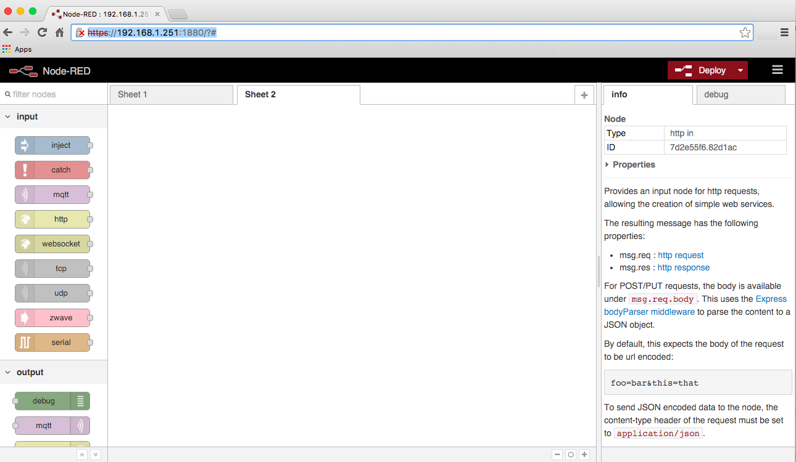
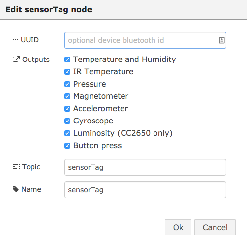

# Getting Started With Node-RED and TI* SensorTag #
<cr>

## Overview ##
Node-RED is a tool for wiring together hardware devices, APIs and online services in new and interesting ways. Node-RED provides a browser-based flow editor that makes it easy to wire together flows using the wide range nodes in the palette. Flows can be then deployed to the run-time in a single-click. The light-weight run-time is built on Node.js, taking full advantage of its event-driven, non-blocking model. This makes it ideal to run at the edge of the network. The TI* multi-standard SensorTag, based on the SimpleLink ultra-low power CC2650 wireless MCU, supports development for Bluetooth Smart, 6LoWPAN and ZigBee. This SensorTag has a unique feature that allows developers to change between different 2.4 GHz technologies by simply loading new software images directly from the SensorTag app over-the-air. In this example, we’ll be communicating to the SensorTag via Bluetooth Low Energy (BLE). The SensorTag includes the following sensors: Infrared and Ambient Temperature, Ambient Light, Humidity, Barometric Pressure, 9-axis motion tracking, and Magnet.

## Required Hardware ##
-   IoT Gateway that uses Intel® IoT Gateway Technology
-   TI SimpleLink Multi-Standard SensorTag Development Kit

## Assumptions ##
-   Intel® IoT Gateway Technology version 3.1 or above
-   Node.js is installed on the IoT Gateway (installed by default)
-   Node-RED node node-red-node-sensortag is installed on the IoT Gateway
	- You can install this package by clicking on Packages and then Add Packages from the Intel® IoT Gateway Developer Hub
-   Node-RED is installed on the IoT Gateway and is running (installed by default)

## Enabling Bluetooth Low Energy (BLE) on the IoT Gateway ##
By default, Bluetooth is enabled but Bluetooth Low Energy (BLE) is not.
This is easy to turn off via the IoT Gateway administrative web
console. You can access the console via <https://ipaddressofthegateway>.
-   Log in using your root username and password
-   Click on the Administration icon and then the Lunch button under LuCI to launch the IoT gateway administration console.

-   Log in using your root username and password.
-   Select Network from the menu and choose Bluetooth
-   If it says “Disabled” next to Bluetooth Status, click on the Disabled button

It should look like this when setup correctly

## Bluetooth Test ##
Before we start, let’s make sure the IoT Gateway can discover the SensorTag device. Ensure a battery is installed in the SensorTag power it on (it goes to sleep if there are no active connections to it). To
turn it on, just press the small button. You should see a green LED start flashing. By the way, when a connection is established to the SensorTag, this LED will turn off. Type the following on the IoT Gateway
console prompt: 

>hcitool lescan

It should respond with something like this:

>LE Scan …
>
>B4:99:4C:1E:C0:C0 CC2650 SensorTag

It may also show other Bluetooh devices in range.
Press Ctrl-C to stop the scanning tool. If it doesn’t show your SensorTag, make sure the SensorTag is turned on and the LED is flashing and try again.

## Using Node-RED ##
The Node-RED browser interface can be reached via
<http://ipaddressofthegateway:1880>. When it first comes up it will look
something like this.

Let’s create a Node-RED flow to get the sensor readings from the SensorTag.

Drag the following nodes from the left bar on to Sheet 1

-   sensorTag
-   Debug

Now, configure the nodes:

-   Double click on the sensorTag node and check what sensors you’d like to include. For this example, let’s check them all. Set the name to sensorTag. Leave the UUID blank (if you have more than 1 SensorTag in range, you can set this to the MAC address of the SensorTag you want to talk to. For this example, we’ll assume there is only one in range. Leave the other fields as default. For example:

-   Click OK
-   Now wire the sensorTag node to the Debug node by clicking and dragging between the small box on the right of the sensorTag node to the small box on the left of the Debug node. It should look like this:

-   Click on the Deploy button, top right, and Confirm deploy.
-   Ensure the “debug” node is turned on. The box extending to the right of the node should be solid/filled in green.
-   Switch the column on the right from the Info tab to the debug tab.
-   The sensor readings show appear in the debug tab (you may need to press the power button on the SensorTag to turn it on if it’s gone to sleep since we turned it on in the above steps.

**Congratulations! You are successfully communicating via BlueTooth low energy to a SensorTag device.**

## Example flow ##
Node-RED supports exporting and importing of flows (into source json).  Here is an export of the above two flows we created. If you import this, the same nodes and configuration we created manually will automatically
appear on the selected Sheet. Import and Export can be found in the Node-RED menu by clicking on the 3 horizontal lines to the right of the Deploy button.

    [{"id":"f80454e.f07fba8","type":"sensorTag","name":"sensorTag","topic":"sensorTag","uuid":"","temperature":true,"humidity":true,"pressure":true,"magnetometer":true,"accelerometer":true,"gyroscope":true,"keys":true,"luxometer":true,"x":240,"y":266,"z":"ec8b1eb.f1374e","wires":[["ad11b15b.52ee5"]]},{"id":"ad11b15b.52ee5","type":"debug","name":"","active":true,"console":"false","complete":"payload","x":543,"y":276,"z":"ec8b1eb.f1374e","wires":[]}]

## References ##
-   [SensorTag](http://www.ti.com/ww/en/wireless_connectivity/sensortag2015/index.html)
-   [Node-red-node-sensortag](https://www.npmjs.com/package/node-red-node-sensortag)
-   [Node-RED](http://nodered.org/)

*indicates that third-party names might be the property of others.

