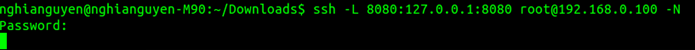
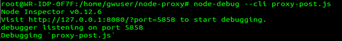

# Remote Debug nodejs applications on IoT Gateways that use Intel® IoT Gateway Technology #
<cr>
 
## Introduction: ##
 
This recipe describes the steps to remote debug a nodejs app running on IoT Gateways that use Intel® IoT Gateway Technology with the Node-Inspector* tool.   Although the Intel® IoT Gateway Developer Hub supports remote debugging JavaScript* applications with Wind River® Helix™ App Cloud; this is an alternative approach.   
 
###Scenario:  
- IoT Gateways that use Intel® IoT Gateway Technology		: The IoT gateway where the nodejs app is running
- Development PC (PC)	: A development PC connected to the IoT Gateway network.**
 
 Example:
 
	**[GW: 192.168.0.100]	  <=>	 [PC: 192.168.0.107]**                       
 
##Requirements:
 
* IoT Gateway: Install the node-inspector module (0.12.6) on the IoT gateway
   
    $ sudo npm install –g node-inspector
 
* PC : install a Chrome* browser
 
##Setup & Debug:
 
1. PC: In a PC terminal window, use SSH to forward the remote debugging port to the IoT gateway.
 
     $ ssh –L 8080:127.0.0.1:8080 root@192.168.0.100 -N
 
>Enter the password for the IoT gateway '<user>@<host target>' - the default pw is: root  
   Notes: copy-and-paste the above cmd can cause error 'could not resolve host name' - just type in the command.  

   Example:

   
2. IoT Gateway:  Open a terminal window on the gateway.
>Note:  OR open a SSH terminal from the remote PC with  
 
        # ssh root@192.168.0.100  and password: root
 
* Navigate to the nodejs app folder
 
    $ cd  /home/gwuser/<folder>
 
* Run the node inspector debugger with this command:
 
    $ node-debug --cli <node-appname.js>

   Example:
	
	
  * Note: to enable live editing, specify the option --save-live-edit on the command as: 
 
    $ node-debug --cli --save-live-edit <node-appname.js>
 
>To edit, set the cursor on a source line and make changes.  Once done, right-click and select save.  
 
3. PC: Start the remote debug session by opening a Chrome browser with the URL (as displayed in the IoT Gateway terminal)
 
    http://127.0.0.1:8080/?port=5858
 
    * The browser will show the Node-Inspector debugger
    * From the right-hand panel,  you can single-step (into/over), inspect variable, view the stack, and set breakpoint and run through the code
    * If the code breaks, the debugger connection also break.  Fix the problem and re-run step #2, and refresh the browser
    * The app console output will be shown in the IoT Gateway terminal windows in step #2.
 
4.	Node-Inspector works almost identical to the Chrome* Dev Tool, the references for using Node-Inspector are here
 
    https://developer.chrome.com/devtools/docs/javascript-debugging
    https://www.npmjs.com/package/node-inspector
    https://docs.strongloop.com/display/SLC/Using+Node+Inspector

*indicates that third-party names might be the property of others.
