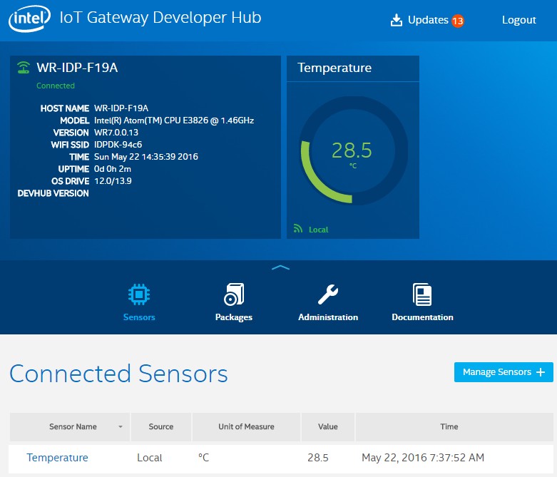
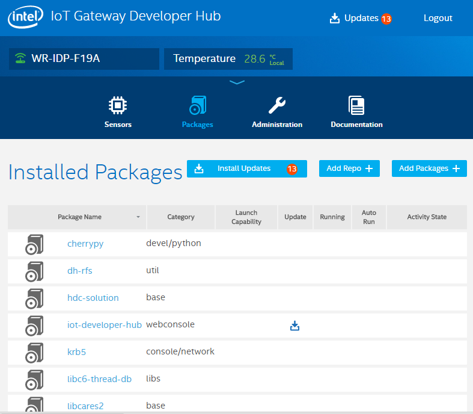
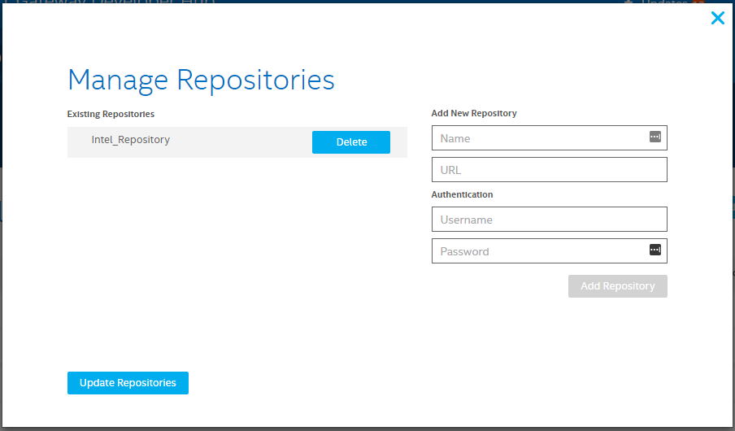
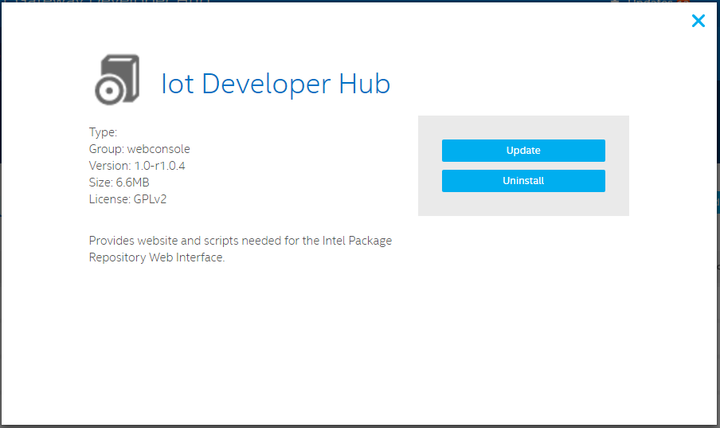
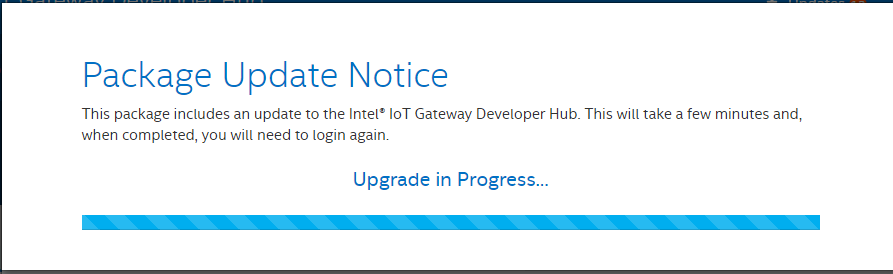
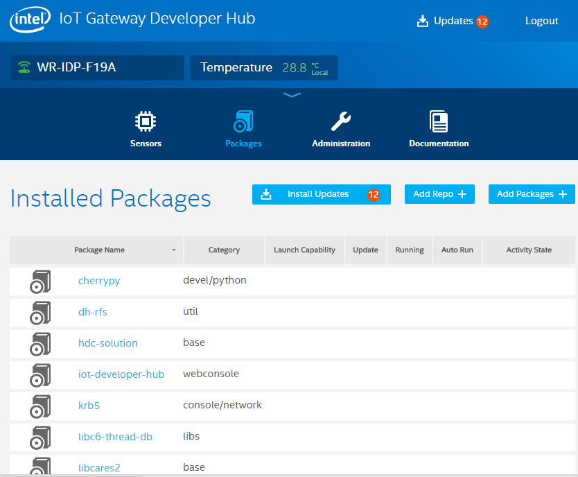
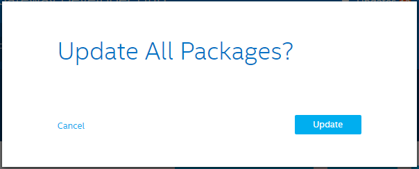

# Updating the Intel IoT Gateway Developer Packages #
<cr>

## Overview ##
As periodic updates are released, it is important to ensure that you are keeping your gateway development environment up to date.  The Developer Hub interface provides an easy mechanism to perform these package updates.

Note that this is not the process to update the operating system to the latest Rolling Cumulative Patch Layer (RCPL).  A different guide will be published for that.

## Required Hardware ##
-   IoT Gateway that uses Intel® IoT Gateway Technology
-   A system running a web browser.  In the case of this tutorial, we used a laptop running Windows 10 and Chrome.

## Assumptions ##
-   Intel® IoT Gateway Technology version 3.1 or above
-   You have network connectivity to the IoT Gateway and you know it's IP address

## Access The Developer Hub ##
To access the Developer Hub, open your web browser and go the <http://ipaddressofthegateway>. Log in with the username and & password.  Once connected, you should see something like this:



You can see by the update indicator in the top right corner that you have updates indicated by the number next to the word Updates.  In this case we have 13.  Before clicking to update, it is important that you first update the Developer Hub itself.  This will ensure that the Developer Hub has the latest code to deal with the rest of the updates since it is performing the updates.  You can minimize the charting area to have more screen real estate by clicking the up arrow under the charting area.  Next click on the packages tab in order to expose the ability to update and control individual packages.  Don't worry if your package list is not yet populated.



For the next steps we need to ensure that your gateway has access to the public internet.  You can use the proxy configuration settings on the Administration tab to help with this if you are behind a proxy.

Once this is confirmed, click on the Add Repo button where it will allow us to ensure we have all of the latest packages to be updated.  You will see the Intel_Repository there by default.  Click on the Update Repositories button.  After a minute or so, the button text will change to Updated.  You can close this window and you should now have an update list of packages under the packages tab.



At this point, click the iot-developer-hub package and a new screen will allow you to update or uninstall that package.  Proceed to update the iot-developer-hub package.





As the notice indicates, this will take a few minutes.  It has to download the package update from the internet and install it (which restarts the Developer Hub Interface).  This all takes some time, but once you are able to refresh your browser pointing to the gateway IP address and see the Developer Hub up and running again, you should be good to go.

Log in again to the Developer Hub and click on the packages tab.  At this point you should see that you have one less package to update (indicating that you were successful in updating the iot-developer-hub).  In this case it now shows 12 updates instead of 13.  If you believe that the update was successful, but the indicator is still showing it hasn't, you can try to update the repositories under Add Repo again to refresh the packages.



You are now ready to install the rest of the packages.  To do this you can click on the Install Updates button under the packages tab.  It will update the rest of the packages in one action.





You will notice that the Install Updates button text changes to Installing Updates.  This action will again take some time as several packages need to be downloaded and installed.  This will also restart several software services running on the gateway.

Once the button text changes back to Install updates, you should be able to refresh the browser and see that you have no remaining updates.  If enough time is passed that you are convinced it should be done, but the status isn't reflected in the Developer Hub, then you can try to update the repositories under Add Repo again to refresh the packages.

Your Developer Hub should now be up to date.
